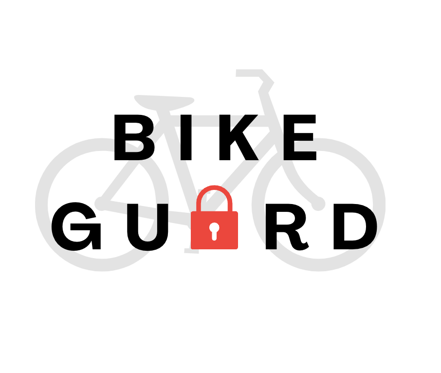

# BikeGuard

<p align="center">

</p>
A bike security system using Raspberry Pi for movement detection and notifications.

## Setup Instructions

### Frontend Setup
```bash
# Go to the frontend directory
cd bike-guard/frontend
# Install all frontend dependencies using npm:
npm install
# This single command will install all the packages defined in package.json file
```
To start the development server:
```bash
npm start
```

### Backend Setup
```bash
# Go to the backend directory
cd ../backend
# Create a python virtual environment
python -m venv .venv
# Activate the virtual environment:
# on windows:
.venv\Scripts\activate
# on mac:
source .venv/bin/activate

# Then, install all backend dependencies:
pip install -r requirements.txt
```

To start the flask server:
```bash
python app.py
```

### For Production and Testing
To build the frontend for production or PWA testing:
```bash
cd frontend
npm run build
serve -s build
```

### Hardware Setup (Raspberry Pi)
1. Activate the virtual environment and install dependencies (same as backend setup)
2. Run the node script:
```bash
cd hardware
node log_mpu_data.js
```

## Project Structure
```
bike-guard/
├── frontend/         # React frontend
├── backend/         # Flask server
│   └── app.py      # Main server file
├── hardware/        # Raspberry Pi code
│   └── log_mpu_data_.js
│   └── accelerometer.py
│   └── picam3.py
├── requirements.txt # Python dependencies
└── README.md
```

## Configuration
- The Flask backend runs on port 5000
- The React frontend runs on port 3000
- Make sure to update the API URLs in both frontend and hardware code if needed

## Notes
- You need Python 3.8+ installed
- Raspberry Pi Camera module code written for Debian Bullseye Raspberry Pi OS
# EC418FinalProj
