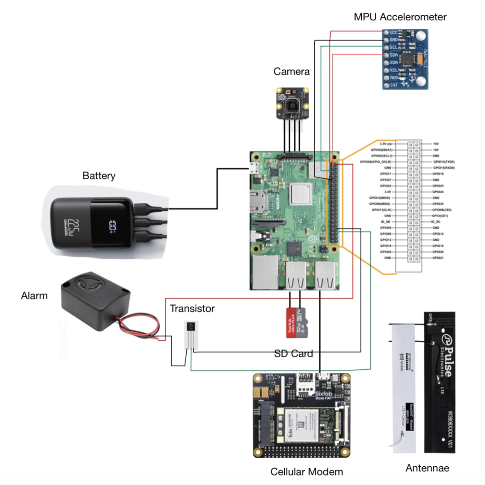
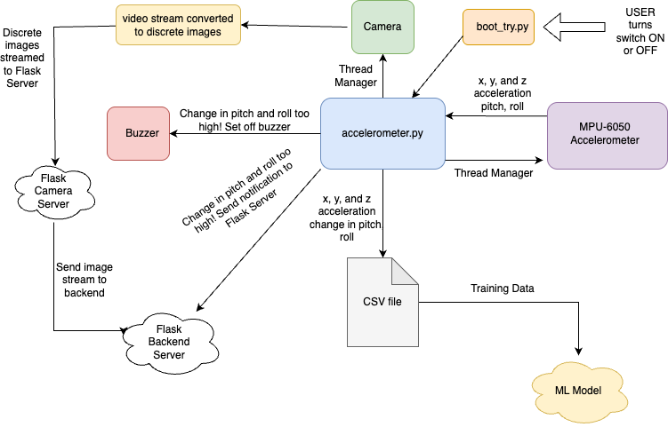

# Hardware Readme
This read me will cover the hardware components of BikeGuard. Note to self for future: in the future we can try to implement everything with Python.

## Components Needed
The components necessary for this project include:
- Raspberry Pi 4 (with 32GB SanDisk SDHC Class 10 card)
- Piezo Buzzer 110 db
- IRLZ44N Mosfet 
- MPU-6050 (Accelerometer)
- INIU BI-B61 Portable Charger 22.5W 10000mAh Power Bank
- Raspberry Pi Camera Module V3 NoIR Wide
- 12mm On/Off Metal Key Lock Switch
- TP Link Router
- Small Breadboard
- Electrical Tape
- Jumper cable
- USB-C to micro USB cable
- USB C Extension Cable 1ft, 1-Pack, USB C 3.2 Male to USB C Female Cable
- 2-Pack 1.5ft Short Braided USB 3.0 A to A Cable - Male to Male
- small heat sinks
- 3D Printed Enclosure + lid

  <strong>Fig 1:</strong> Hardware components overview

  <strong>Fig 2:</strong> Completed hardware before entering enclosure.

## Set Up Explained
Our hardware setup includes a Key Lock Switch, a  Raspberry Pi 4, a corresponding Raspberry Pi Camera module V3 NoIR Wide, an accelerometer, and a buzzer. We use a router to establish our network within the broader BU wifi. We connected the Raspberry Pi to the network and are hosting all our servers on the network. We use SSH to access the Raspberry Pi remotely. We are powering the Raspberry PI with a portable power bank that is intended to charge phones and tablets. We additionally attached small heat sinks to our Raspberry Pi to prevent it from overheating. Once the Raspberry Pi is powered on, a boot_try.py script is automatically run. The boot_try.py script listens for GPIO signals from a Key Lock switch, which activates all of our software once the Key Lock is turned to the active position. This was implemented to save power. Our components are housed in a 3D printed enclosure attached to the bike with clamps. The accelerometer's data are saved in a CSV file using python libraries. In this manner, the data can be used to train the machine learning model to recognize possible bike theft. Once the pitch and roll reach a certain threshold while shaking, the buzzer goes off. Once the buzzer goes off it can be stopped through a button on the website. The backend file app.py receives constant information from the raspberry pi accelerometer.py folder. If the accelerometer detects motion greater than a pre-set threshold, it sends a push request to the backend and stores the message in the SQL database. Once the front end detects new changes in the database, it displays the most recent message on our website. As for the camera live view, the Raspberry Pi already has a module to convert real video feed into mpng (different format of png), then using flask we can stream the video feed directly to the front end. 

  
  <strong>Fig 3:</strong>: Hardware diagram

## Set Up Procedure
1. Connect and turn on the router.
2. Switch key switch to ON (green color)

## Code Flow Explained
Figure 4 shows the onboard software flow chart. The Python script boot_try.py is run as soon as the Raspberry Pi boots. When the user switches the key switch to ON, the boot_try.py is alerted via GPIO connection and runs the accelerometer.py script. The accelerometer.py script is the device’s driving code. It has two processes running under a thread manager: the camera and the accelerometer. The camera thread continuously polls video data from the Raspberry Pi camera. This video stream is converted to a stream of discrete images for easier front-end implementation. This stream of discrete images is then sent to a Flask server hosted on the Raspberry Pi. This is then sent to our main backend server to be embedded into the front-end user interface. The accelerometer thread polls x, y, and z acceleration from the accelerometer, which the accelerometer thread then converts to pitch and roll. The accelerometer thread also keeps track of changes in pitch and roll by comparing current pitch and roll values to pitch and roll values from the previous time step. The change in pitch and roll is more useful for identifying shaking. The accelerometer thread then writes the x, y, and z acceleration as well as the change in pitch and roll values to a CSV fil,e which can be used later to train the machine learning model. If the accelerometer thread detects changes in pitch and roll values that are too high, it will set off the buzzer and send a notification to the back-end server.

  <strong>Fig 4:</strong> Onboard software flow chart

